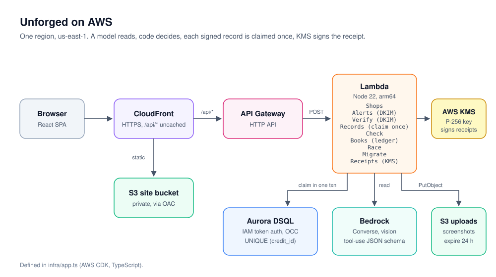

# Unforged

**A signed email is proof nobody can forge, and each proof can be claimed exactly once.**

Banks, employers, marketplaces and airlines already DKIM-sign the emails they
send: credit alerts, payslips, refunds, bookings. Unforged checks a claim
against that signed email in code, and lets each signed record be claimed one
time only.

Live app: https://d1ajauwkb76on3.cloudfront.net

## The first case: is that UPI payment real?

A buyer shows a seller a UPI payment screenshot. A screenshot is a picture of a
payment, not a payment. It can be edited, or it can be a real screenshot from
an earlier order shown again.

The seller's bank has already sent the one record the buyer cannot edit: the
credit alert email, signed with the bank's DKIM key. Unforged checks the
screenshot against that alert. Bedrock reads the screenshot. Code makes the
decision. Each bank credit can be claimed once, so an old, real screenshot
shown for a second order is caught.

## How it works

1. **Signed alert in.** The seller pastes the raw source of a bank credit alert
   ("Show original" in Gmail). The `Alerts` Lambda verifies the DKIM signature
   with [`mailauth`](https://github.com/postalsys/mailauth) against the bank's
   own DNS key. The signing domain must pass, must be aligned with the From
   address, and must belong to a bank on the allowlist in
   [`src/core/alert.ts`](src/core/alert.ts). Only then is the amount and UTR
   parsed and stored as a credit. An alert that fails DKIM, or comes from a
   domain off the allowlist, is rejected with its reason and is never stored as
   verified.
2. **Screenshot read.** The `Check` Lambda sends the screenshot to Amazon
   Bedrock Converse with a forced tool call and a JSON schema
   ([`src/core/read.ts`](src/core/read.ts)). The model reports the UTR, amount,
   payee VPA, payee name and app, or says the image is not readable. Code
   validates the output: a UTR must have 12 digits and the amount must parse,
   or the read counts as unreadable.
3. **Claimed once.** Code matches the read against the shop's credits
   ([`src/core/verdict.ts`](src/core/verdict.ts)) and, if everything agrees,
   inserts a claim row in one Aurora DSQL transaction
   ([`src/core/claim.ts`](src/core/claim.ts)). A unique index on
   `claims(credit_id)` means only one insert can ever succeed for a given bank
   credit. DSQL uses optimistic concurrency, so a transaction that loses a
   conflict (SQLSTATE `40001`, `OC000`, `OC001`) is retried with jittered
   backoff, up to 8 attempts. A retry that then hits the unique key
   (`23505`) becomes `ALREADY_CLAIMED`, never a second approval.

4. **Any signed email, checked in the open.** `POST /api/verify` runs the same
   DKIM check on any email and reports the signer, selector and alignment,
   and whether it would be accepted as a bank credit. It stores nothing. The
   Try it page uses it to let anyone paste an email they received, then
   change one character and watch the signature break.
5. **The ledger.** `POST /api/ledger` (shop token) lists the shop's signed
   credits, which order claimed each one and when, and the latest checks with
   their verdicts.

### Verdicts

Every verdict is decided by code, never by a prompt. There is no fraud score.
Each verdict is discrete and carries its reason.

| # | Condition | Verdict |
|---|---|---|
| 1 | Screenshot unreadable, or missing UTR or amount | `UNREADABLE` (nothing is guessed) |
| 2 | No credit with this UTR for the shop | `NOT_FOUND_YET` (alerts can lag; check again) |
| 3 | Credit exists, amount differs | `AMOUNT_MISMATCH` (both amounts shown) |
| 4 | Payee on the screenshot is not the shop's VPA | `PAYEE_MISMATCH` |
| 5 | Claim insert hits the unique key | `ALREADY_CLAIMED` (shows the earlier order) |
| 6 | Otherwise | `VERIFIED` (shows bank, alert time and DKIM domain) |

### What it deliberately does not do

- **No UTR date-digit check.** Older advice says to check the "YDDD" digits
  of a UTR. NPCI revised the RRN in 2024 and told banks to stop validating
  YDDD by 31 May 2024
  ([source](https://lexplosion.in/npci-revises-retrieval-reference-number-in-upi-to-avoid-duplicates-psps-and-banks-to-implement-revised-rrn-and-remove-validation-of-yddd-by-31st-may-2024/)),
  so Unforged does not use it.
- **No fraud score and no guessing.** `UNREADABLE` is a valid answer.
- **No unsigned source shown as verified.** A credit exists only if its email
  passed DKIM from an allowlisted bank domain.
- **No login.** Each shop gets a capability token (sent as `x-shop-token`,
  stored only as a SHA-256 hash).

## AWS services

All in one region, `us-east-1`. Defined in [`infra/app.ts`](infra/app.ts).



| Service | What it does here |
|---|---|
| Amazon CloudFront | Serves the SPA from S3 and forwards `/api/*` to the HTTP API, HTTPS only, no caching on the API path |
| Amazon S3 (site bucket) | Holds the built SPA. Private, reached only through CloudFront Origin Access Control |
| Amazon S3 (upload bucket) | Stores each checked screenshot under its SHA-256. Private, SSL enforced, lifecycle rule deletes objects after 1 day (24 h) |
| Amazon API Gateway HTTP API | `POST /api/shops`, `/api/alerts`, `/api/check`, `/api/verify`, `/api/ledger`, `/api/race`, `/api/spike/dkim`; throttled to 25 req/s, burst 50 |
| AWS Lambda | Eight functions, Node.js 22 on arm64, bundled with esbuild: `Shops`, `Alerts`, `Verify` (DKIM report for any email, stores nothing), `Check`, `Books` (the shop's ledger), `Race`, `Spike` (DKIM DNS timing), and `Migrate` (schema setup, invoked directly, not routed) |
| Amazon Aurora DSQL | Shops, credits, claims, attempts and the naive control table. IAM token auth from Lambda (`dsql:DbConnectAdmin`), no VPC, no passwords. Unique indexes built with `CREATE UNIQUE INDEX ASYNC` |
| Amazon Bedrock | Converse API with vision and a tool-use JSON schema. The model ID is a CDK context value; the default in `cdk.json` is `us.amazon.nova-2-lite-v1:0` |
| AWS IAM | Per-function least-privilege grants: DSQL connect on the one cluster, `s3:PutObject` on the upload bucket and Bedrock invoke for `Check` only |
| AWS CDK (TypeScript) | The whole stack as code, deployed by the coding agent |

### Why Aurora DSQL, and the honest alternative

The claim-once rule could be built on Amazon DynamoDB: a `TransactWriteItems`
call with a `ConditionExpression` of `attribute_not_exists` on a claim item
keyed by the credit ID. That gives the same exactly-once result and would work
well.

DSQL was chosen because the data is relational and queried relationally
(credits by shop and UTR, the claim that beat you, every attempt with its
verdict), and because the guarantee is then a plain unique index and one SQL
transaction that any Postgres reader can audit. DSQL also needs no VPC, no
connection secrets and no capacity planning from Lambda: IAM signs a short-lived
token. The cost of that choice is optimistic concurrency, which is why the
claim path has a bounded retry, and why the race test exists to show it holds.

### The race test

`POST /api/race` inserts a fixture credit and fires 50 claims at it at once
(configurable from 2 to 100). It then runs the same number against
`claims_naive`, a table with no unique index, using select-then-insert. The
response reports winners, `ALREADY_CLAIMED` counts, errors and OCC retries for
the guarded path, and accepted claims for the naive one.

## Measurements

Every number about Unforged comes from a real run against the live stack and
is recorded in [`docs/measurements.md`](docs/measurements.md), with raw JSON in
`measurements/`. Forgery matrix, screenshot extraction accuracy and DKIM DNS
latency are pending real samples and are not quoted until they exist there.

**Race, 1 Oct 2026** (`pnpm measure:race`, 20 rounds × 50 claims of one fresh
credit at the same instant):

| Metric | Unique index | Naive control |
| --- | --- | --- |
| Rounds with exactly one winner | 20/20 | 0/20 |
| Rounds with more than one winner | 0/20 | 20/20 |
| Total approvals (1 is correct per round) | 20 | 1000 |
| Errors | 0 | 0 |
| Batch time p50 | 134 ms | 40 ms |
| Batch time p95 | 198 ms | 73 ms |

Client round trip for a whole round (both arms): p50 492 ms, p95 888 ms. The
Lambda's pg pool holds 20 connections, so at most 20 of the 50 claims are in
flight at the database at once. Batch time is for all 50 claims, not per claim.

**Replay, 1 Oct 2026** (`pnpm measure:replay`, 10 rounds, the same credit
claimed twice one after the other):

| Path | Approved first claims | Approved second claims |
| --- | --- | --- |
| Unique index | 10/10 | 0/10 |
| Naive check-then-insert | 10/10 | 0/10 |

A sequential replay is caught even by a naive check. The naive path fails only
when claims arrive together (the race above). The unique index holds under
both.

## Run it

Requirements: Node.js 22, pnpm, and for deploys an AWS account with CDK
bootstrapped in `us-east-1`.

```sh
pnpm install
pnpm check          # tsc on src, infra and web, then vitest
pnpm web            # run the SPA locally with Vite
pnpm synth          # build the SPA and synthesise the CDK stack
pnpm deploy         # build the SPA and deploy the stack
```

After the first deploy, invoke the function named in the `MigrateFunction`
stack output once to create the tables and indexes. The `Url` output is the
public CloudFront address. To try a different Bedrock model:
`pnpm deploy -c modelId=<model or inference profile id>`.

Real `.eml` files are gitignored. Only redacted fixtures under
`test/fixtures/` are committed.

## Coding agent

Unforged is built with a coding agent connected to AWS, which also deploys it
as the IAM identity `unforged-agent`. The proof (MCP connection, transcript,
CloudTrail events for that identity) goes in
[`docs/agent-proof/`](docs/agent-proof/).

## Lineage

The claim-once pattern comes from my earlier project, Stub. The code here is
new and written for this problem.

Built for the AWS Builder Center "Zero to Shipped" hackathon:
`#daily-life-enhancement`, `#startups`.
